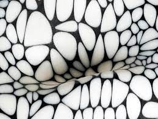

<!-- English Section -->
# An influential woman who never stops innovating
{: img align="left" style="float: left"; height="40%" width="40%"}

Neri Oxman was born in Haifa, Israel on February 6, 1976. She is of Jewish heritage and both her mother and father were educated architects. When growing up in Israel, Neri would spend time in her grandmother’s house exploring the garden. She would also experience the atmosphere of her parents' architect work studio. These two backgrounds would combine to influence Neri’s work as a scientist and as an artist.

 To jump start her educational journey, Neri started out in the Israeli Armed Forces reaching the rank of Lieutenant. After her service, she went on to complete her Bachelor’s in architecture at the Hebrew Reali School and the Technion Israel Institute of Technology. Neri was not done however, and decided to do her Masters in Hebrew University of Jerusalem. During her study, she moved to London to transfer to the Architectural Association school where she completed her Masters. Of course Masters is not enough, Neri would lastly move to the United States to complete her PhD at Massachusetts Institute of Technology. 

With all the experience and knowledge Neri gained from her home environment and studying abroad, it is evident that she would have a very unique perspective in her field of study. This is seen with all her work she has in several museums/collections which include the Museum of Modern Art, the Cooper Hewitt Design Museum, the Museum of Science and much more.

Neri has a specific direction when it comes to her work. She would describe this as “a shift from consuming nature as a geological resource to editing it as a biological one.” She would take a biological approach to nature and would display the perspective of that into her art form.
{: img align="right" style="float: left"; height="40%" width="40%"}
Of Neri’s Monocoque series (one from many collections of her art), there is a piece of work that mixes science with art. It is called Structural skin and what it displays is a similarity of an egg shell’s skin structure. The work is currently stored in the Museum of Modern Art in New York, New York.  

Outside of the Neri’s influence in art, her skills come from her proficiency in organic natural fabrication and interests in 3D modeling and printing. This fabrication is the process of taking animals and nature’s processes and allowing them to fabricate items naturally. For example, the butterfly’s natural process of creating a cocoon is an example of natural fabrication. Neri’s 3D modelling/printing involves her creating wearables (for humans) that are a mix of animal and humanoid. They seem to be inspired by biological creatures.

Countless times Neri has changed and influenced the world with her combination of art and science. There seems to be no limit to her imagination as she will continue her collections and findings.

## References:
* [https://aussiecelebs.com.au/neri-oxman/](https://aussiecelebs.com.au/neri-oxman/)
* [https://www.nytimes.com/2018/10/06/style/neri-oxman-mit.html](https://www.nytimes.com/2018/10/06/style/neri-oxman-mit.html)
* [https://www.thefamouspeople.com/profiles/neri-oxman-37712.php](https://www.thefamouspeople.com/profiles/neri-oxman-37712.php)
* [https://www.media.mit.edu/people/neri/overview/](https://www.media.mit.edu/people/neri/overview/)
* [https://www.media.mit.edu/people/neri/projects/](https://www.media.mit.edu/people/neri/projects/)
