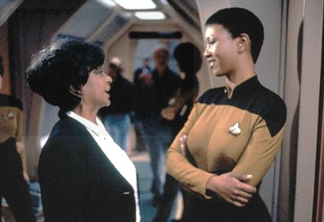
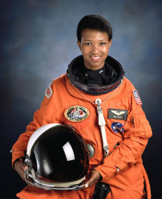

<!-- English Section -->
# The First African-AmericanWoman in Space
{: img align="left" style="float: right"; height="60%" width="60%"}
At a young age Dr. Jemison was always curious about theuniverse. Throughout her early school years she spent an abundant amount of time in her school library reading about all aspects of science. She was also an avid Star Trek fan! Aboard the fictional  USS Enterprise was Lt. Uhura, who is played by the actress Nichelle Nichols, Nichelle’s important portrayal as Lt. Uhara allowed Mae to envision herself in outer space.  Dr. Jemison was 16 when she graduated highschool, she would then receive her undergraduate degree at Stanford University. 

Jemison attended Cornell Medical School. During her attendance, she worked for Flying Doctors in East Africa, worked at a Cambodian refugee camp, and conducted a research study in Thailand. During her time at Cornell, she continued to study dance at the Alvin Ailey American Dance Theater. After graduating with her M.D., she interned at the USC Medical Center and worked as a general practitioner for the Ross-Loos Medical Group.

From 1983 to 1985, she was a member of the staff of the Peace Corps and served as a medical officer. She had theresponsibility of keeping track of the health ofPeace Corps volunteers in Liberia and SierraLeone. She also worked for the Centers for DiseaseControl helping with vaccine research.

{: img align="right" style="float: right"; height="40%" width="40%"}

After leaving the Peace Corps, she enteredprivate practice and took graduate-levelengineering courses. After seeing the rocket flightsof Sally Ride and Guin Blufored in 1983, Jemisonwas inspired to apply for NASA’s astronautprogram. Although she first applied in 1985, NASAhad to postpone the selection of new astronauts due to the Challenger accident in 1986. However, she reapplied in 1987 and was chosen to be one of fifteen people in NASA Astronaut Group 12 Jemison's work with NASA before her shuttle launch included launch support activities at the Kennedy Space Center in Florida and verification of Shuttle computer software in the Shuttle Avionics Integration Laboratory. On September 28, 1989, she was selected to join the STS-47 crew and became the first black woman to enter space. Jemison resigned from NASA in 1993 and established the Jemison Group, a company that seeks to research, develop and market advanced technologies.

## References:
* “Mae C. Jemison.” Biography.com, A&E Networks Television, 17 Feb. 2021, www.biography.com/astronaut/mae-c-jemison.
* Alexander, Kerri Lee. “Mae Jemison.” National Women's History Museum, www.womenshistory.org/education-resources/biographies/mae-jemison.
* “Dr. Mae Jemison.” Dorothy Jemison, jemisonfoundation.org/about/mae-jemison/.
* https://www.nasa.gov/sites/default/files/atoms/files/jemison_mae.pdf4